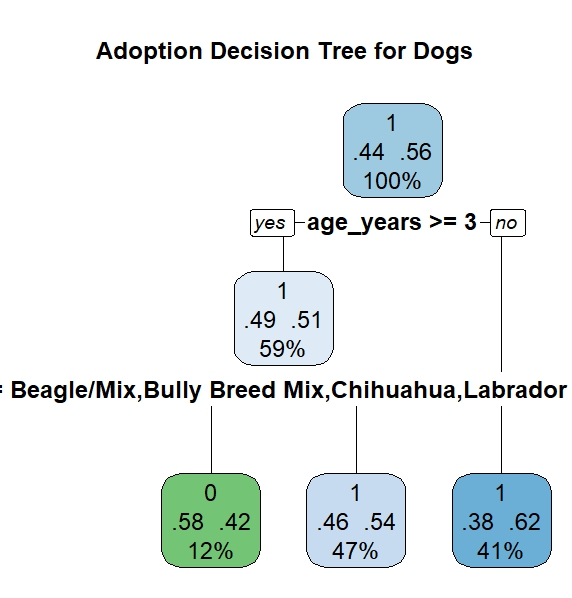

#  Pet Adoption Analysis: Uncovering Patterns in Shelter Outcomes

This project analyzes shelter animal intake and outcome data to identify the key factors that influence whether an animal gets adopted. Using logistic regression, decision trees, and random forest models, it reveals patterns that can help shelters improve adoption strategies and reduce return rates.

---

##  Project Summary

Animal shelters face challenges with overcrowding, limited resources, and high return rates. This project explores patterns in adoption outcomes by analyzing structured data on animal characteristics, intake reasons, and movement types(adopted/ notadopted).

In 2023 alone, California and Texas euthanized over 40,000 dogs due to high rates of animal surrender, overcrowded shelters, and insufficient funding, as seen in chart below:

###  Dog Euthanasia in 2023

**Main Goals:**
- Determine which features (age, breed, species, etc.) most influence adoption outcomes
- Predict the likelihood of adoption using machine learning models
- Provide actionable insights for shelters to optimize their adoption processes

 ##  Tools & Technologies

- **Languages**: R

 ##  Dataset Description

This project uses real-world animal shelter data to uncover patterns in pet adoption outcomes. The dataset was obtained from [Shelter Pet Data Alliance](https://www.shelterpetdata.org/) and contains detailed intake and outcome records from a municipal shelter. The data is collected by shelters across the country and is updated on the 13th of each month.

##  Dataset Schema

| **Column**           | **Description**                                                 |
|----------------------|-----------------------------------------------------------------|
| `id`                 | Unique animal intake ID                                         |
| `intakedate`         | Date animal entered the shelter                                 |
| `intakereason`       | Reason for intake (e.g., Moving, Abandoned)                     |
| `istransfer`         | 1 if animal was transferred from another facility               |
| `sheltercode`        | Internal shelter code                                           |
| `identichipnumber`   | Microchip or unique ID                                          |
| `animalname`         | Name of the animal                                              |
| `breedname`          | Animal's breed                                                  |
| `basecolour`         | Base color of the animal                                        |
| `speciesname`        | Cat or Dog                                                      |
| `animalage`          | Age at time of intake                                           |
| `sexname`            | Sex (e.g., Male, Female)                                        |
| `location`           | Area of the shelter the animal was housed in                   |
| `movementdate`       | Date the animal left the shelter or moved within it            |
| `movementtype`       | Type of movement (Adoption, Foster, etc.)                       |
| `istrial`            | Indicates if the movement was part of a trial                   |
| `returndate`         | If returned, the date they were returned                        |
| `returnedreason`     | Reason for return (if applicable)                               |
| `deceaseddate`       | Date of death (if applicable)                                   |
| `deceasedreason`     | Reason for death (e.g., died in care)                           |
| `diedoffshelter`     | 1 if death occurred off-shelter                                 |
| `puttosleep`         | 1 if euthanized                                                 |
| `isdoa`              | 1 if dead on arrival                                            |

###  [Click here to view the dataset](animal-data-1.csv)

### Results

###  Top 10 Adopted Dog Breeds

###  Adoption Counts by Age

###  Decision Tree Model

###  Random Forest Feature Importance

###  ROC Curve

###  Return Reasons for Returned Pets

### Adoption Likelihood by Gender

###  Most Popular Dog Breeds in Shelter

