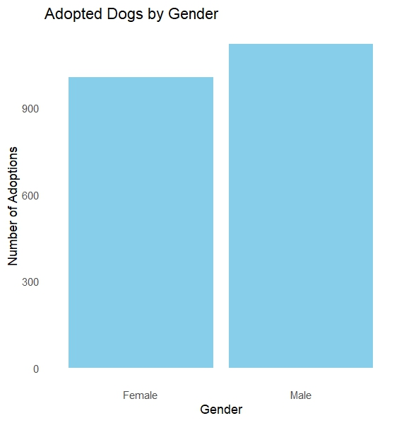

#  Pet Adoption Analysis: Uncovering Patterns in Shelter Outcomes

This project analyzes shelter animal intake and outcome data to identify the key factors that influence whether an animal gets adopted. Using logistic regression, decision trees, and random forest models, it reveals patterns that can help shelters improve adoption strategies and reduce return rates.

---

##  Project Summary

Animal shelters face challenges with overcrowding, limited resources, and high return rates. This project explores patterns in adoption outcomes by analyzing structured data on animal characteristics, intake reasons, and movement types(adopted/ notadopted).

In 2023 alone, California and Texas euthanized over 40,000 dogs due to high rates of animal surrender, overcrowded shelters, and insufficient funding, as seen in chart below:

**Main Goals:**
- Determine which features (age, breed, species, etc.) most influence adoption outcomes
- Predict the likelihood of adoption using machine learning models
- Provide actionable insights for shelters to optimize their adoption processes

  
##  Project Overview

- Focused on **dogs only**
- Cleaned and preprocessed over 30,000 records
- Explored variables like breed, age, sex, intake reason, and adoption outcome
- Built predictive models (logistic regression, decision tree, random forest)
- Created visualizations to communicate trends and actionable insights

# Language 
R was primarlity used in cleaning and manipulating the dataset

##  Data Source

- Shelter Pet Data Alliance  
- Nationwide data, updated monthly  
- Uploaded directly by U.S. shelters

  ###  [Click here to view the dataset](animal-data-1.csv)

##  Dataset Schema

| **Column**           | **Description**                                                 |
|----------------------|-----------------------------------------------------------------|
| `id`                 | Unique animal intake ID                                         |
| `intakedate`         | Date animal entered the shelter                                 |
| `intakereason`       | Reason for intake (e.g., Moving, Abandoned)                     |
| `istransfer`         | 1 if animal was transferred from another facility               |
| `sheltercode`        | Internal shelter code                                           |
| `identichipnumber`   | Microchip or unique ID                                          |
| `animalname`         | Name of the animal                                              |
| `breedname`          | Animal's breed                                                  |
| `basecolour`         | Base color of the animal                                        |
| `speciesname`        | Cat or Dog                                                      |
| `animalage`          | Age at time of intake                                           |
| `sexname`            | Sex (e.g., Male, Female)                                        |
| `location`           | Area of the shelter the animal was housed in                   |
| `movementdate`       | Date the animal left the shelter or moved within it            |
| `movementtype`       | Type of movement (Adoption, Foster, etc.)                       |
| `istrial`            | Indicates if the movement was part of a trial                   |
| `returndate`         | If returned, the date they were returned                        |
| `returnedreason`     | Reason for return (if applicable)                               |
| `deceaseddate`       | Date of death (if applicable)                                   |
| `deceasedreason`     | Reason for death (e.g., died in care)                           |
| `diedoffshelter`     | 1 if death occurred off-shelter                                 |
| `puttosleep`         | 1 if euthanized                                                 |
| `isdoa`              | 1 if dead on arrival                                            |

### Results

###  Return Reasons for Returned Pets

Dogs surrendered due to housing issues or behavior problems had lower chances of successful adoption.

Return rates were higher for dogs adopted without proper breed research or preparation.

###  Top 10 Adopted Dog Breeds

###  Adoption Counts by Age

###  Decision Tree Model

Age

Age was the strongest predictor of adoption.

Puppies and young dogs were significantly more likely to be adopted quickly.

Senior dogs were more likely to remain in shelters or face euthanasia due to limited interest
###  Random Forest Feature Importance

###  ROC Curve

Logistic Regression:

Provided baseline prediction accuracy; age and breed were statistically significant.

Decision Tree:

Visualized decision paths showing how age and breed affect outcomes.

Easily interpretable for non-technical audiences.

Random Forest:

Highest accuracy overall.

Feature importance plot confirmed that age and breed were the top predictors.

### Adoption Likelihood by Gender

###  Most Popular Dog Breeds in Shelter

